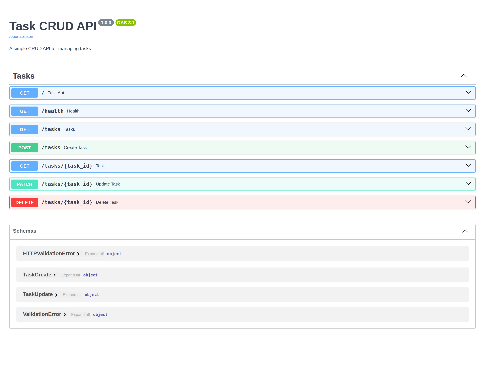
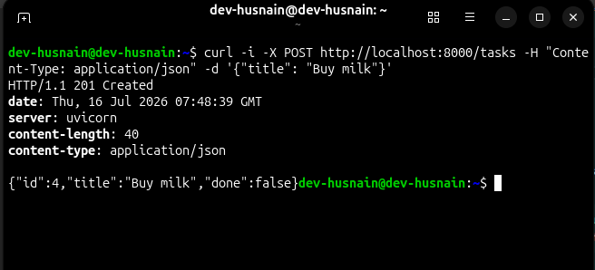

# 🚀 Task CRUD API

A simple **Task CRUD API** built with **FastAPI** for learning REST APIs.

This project demonstrates the core CRUD operations using an in-memory list as the data store.

## ✨ Features

- List all tasks
- Get a single task by ID
- Create a new task
- Update an existing task
- Delete a task
- Interactive Swagger UI
- Automatic OpenAPI documentation

---

# 🛠 Tech Stack

- Python 3.12+
- FastAPI
- Uvicorn
- Pydantic
- uv (Package Manager)

---

# 📦 Installation

### 1. Clone the repository

```bash
git clone https://github.com/<your-username>/task-crud-api.git
cd task-crud-api
```

### 2. Create a virtual environment

```bash
uv venv
```

### 3. Activate it

**Linux / macOS**

```bash
source .venv/bin/activate
```

**Windows**

```powershell
.venv\Scripts\activate
```

### 4. Install dependencies

```bash
uv sync
```

### 5. Run the API

```bash
uv run uvicorn app.main:app --reload
```

The API will be available at:

```
http://127.0.0.1:8000
```

Swagger UI:

```
http://127.0.0.1:8000/docs
```

---

# 📚 API Endpoints

| Method | Endpoint | Description |
|---------|----------|-------------|
| GET | `/` | Project information |
| GET | `/health` | Health check |
| GET | `/tasks` | List all tasks |
| GET | `/tasks/{task_id}` | Get a task by ID |
| POST | `/tasks` | Create a task |
| PATCH | `/tasks/{task_id}` | Update a task |
| DELETE | `/tasks/{task_id}` | Delete a task |

---

# Example Request

Create a task

```bash
curl -i -X POST http://localhost:8000/tasks \
-H "Content-Type: application/json" \
-d '{"title":"Buy milk"}'
```

Example Response

```http
HTTP/1.1 201 Created
date: Thu, 16 Jul 2026 07:48:39 GMT
server: uvicorn
content-length: 40
content-type: application/json

{"id":4,"title":"Buy milk","done":false}
```

---

# 📖 API Documentation

FastAPI automatically generates interactive API documentation.

Open:

```
http://127.0.0.1:8000/docs
```

You can test every endpoint directly from the browser using the **Try it out** button.

---

# 📸 Screenshots

## Swagger UI




---

## CURL Example




---


## Stage 4 – Exploring SQLite

During this stage, I explored the SQLite database using the sqlite3 command-line tool.

### Commands Used

```sql
.tables
.schema tasks
.headers on
.mode column
SELECT * FROM tasks;
SELECT COUNT(*) FROM tasks;
SELECT * FROM tasks WHERE id = 1;


# 📁 Project Structure

```text
app/
├── data/
│   └── storage.py
├── routers/
│   └── tasks.py
├── schemas/
│   └── task.py
├── services/
│   └── task_service.py
└── main.py
```

---

# License

This project is created for learning FastAPI and REST API development.